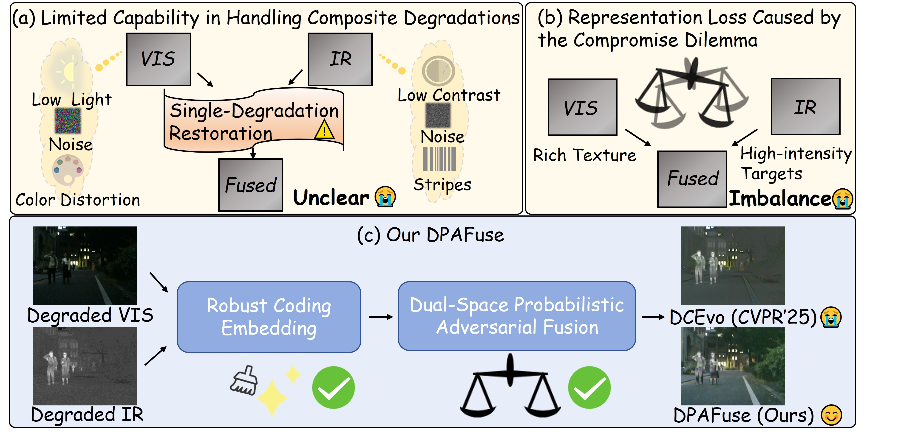

# Code of Paper DPAFuse: A dual-space probabilistic adversarial image fusion framework with robust coding embedding
- [paper](https://www.sciencedirect.com/science/article/pii/S2667325826002463)



## Environment Installation

```bash
conda create -n DPAFuse python=3.9
conda activate DPAFuse
```

```bash
pip install torch==2.1.0 torchvision==0.16.0 torchaudio==2.1.0 \
--index-url https://download.pytorch.org/whl/cu121
```

Install dependencies:

```bash
pip install timm==0.6.12 einops==0.6.0 opencv-python==4.6.0.66
pip install numpy scipy matplotlib pandas PyYAML tqdm tensorboard thop lpips
```

## Data Preparation

Please place the data in the following path (Note: X indicates visible images, and Y indicates infrared images):
```
config\v1\Fusion\datasets
```

## pre-trained weights
We provide pre-trained model parameters. Please download them according to the instruction file paths - [weights Link](https://drive.google.com/drive/folders/1wfDdDj3_ewELd-_VRV5q98nUD7OKWUuI?usp=sharing) at the following addresses.

## Testing
```bash
python test_FIGAN.py -opt ./options/test/test_FIGAN.yml
```
## Training
### 1) Autoencoder
```bash
torchrun --nnodes=1 --nproc_per_node=2  train_AE.py -opt ./options/train/train_AE.yml
```

### 2) Robust Embedding
```bash
torchrun --nnodes=1 --nproc_per_node=2  train_RE_IR.py -opt ./options/train/train_RENet_IR.yml
```

```bash
torchrun --nnodes=1 --nproc_per_node=2  train_RE_VIS.py -opt ./options/train/train_RENet_VIS.yml
```

### 3) DualGAN Fusion 
```bash
torchrun --nnodes=1 --nproc_per_node=2  train_FIGAN.py -opt ./options/train/train_FIGAN.yml
```


## Citation
If our work assists your research, feel free to give us a star or cite us using:
```bash
@article{zhang2026dpafuse,
  title={DPAFuse: A dual-space probabilistic adversarial image fusion framework with robust coding embedding},
  author={Zhang, Hao and Gong, Meiqi and Wu, Douyu and Ma, Jiayi},
  journal={Fundamental Research},
  year={2026},
  publisher={Elsevier}
}
```

## Acknowledgments
Our code is built upon the following libraries. We sincerely thank the authors for their contributions. 
- [OmniFuse](https://github.com/HaoZhang1018/OmniFuse)

## License
This project is released under the terms of the [LICENSE](LICENSE).
